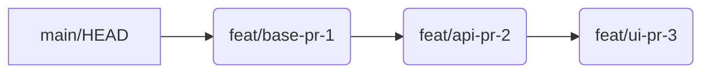

# Beyond Blobs: Taming AI-Generated Code with GitHub Stacked Pull Requests

Welcome back to TechSheet! As a Senior Front-End Architect, I've witnessed countless shifts in our industry, but few have been as impactful and rapid as the rise of AI-powered coding agents. Tools like GitHub Copilot are no longer just intelligent autocomplete; they're becoming increasingly capable of generating substantial, even feature-complete, codebases.

Yet, this incredible velocity often comes with a hidden cost: **the colossal, unreviewable pull request (PR)**. An AI, given a complex prompt, might churn out hundreds, if not thousands, of lines of code, all bundled into a single, overwhelming change. For any senior developer or team lead, this is a nightmare. How do you ensure quality, maintainability, and architectural integrity when you can't even get through the first 100 lines of a 2000-line PR? This isn't just a hypothetical; it's the new reality for many teams.

Today, we're diving deep into a paradigm shift that addresses this challenge head-on: **turning one giant AI-generated pull request into a reviewable stack using GitHub's stacked pull requests.** This isn't just about making your life easier; it's about unlocking the full potential of AI-assisted development without sacrificing code quality or team collaboration.

## The AI's Double-Edged Sword: Velocity vs. Reviewability

AI coding agents excel at speed and breadth. Give them a prompt like "implement a user authentication system with OAuth, a new REST API, and a React front-end," and within minutes, you might have a functional prototype. The problem isn't the AI's capability; it's the monolithic output.

Traditional PR review workflows are designed for human-sized, incremental changes. A PR that touches multiple layers of the application—database migrations, API endpoints, business logic, UI components, and tests—all at once, makes effective review impossible. It leads to:

*   **Overwhelm and Fatigue**: Reviewers stare at a sea of green and red, struggling to grasp the intent or impact.
*   **Missed Issues**: Critical bugs, security vulnerabilities, or architectural missteps are easily overlooked.
*   **Delayed Delivery**: Large PRs sit unmerged, accumulating merge conflicts and blocking downstream work.
*   **Reduced Quality**: The temptation to just "LGTM" (Looks Good To Me) a massive PR is high, leading to technical debt.

This is where the concept of *stacked pull requests* becomes not just an optimization, but a critical necessity for scaling AI-driven development.

## Enter GitHub Stacked Pull Requests: A Paradigm Shift for Collaboration

GitHub, recognizing the evolving landscape of code collaboration, has embraced and enhanced the concept of **stacked pull requests**. While the idea isn't brand new (tools like `git-branch-stack` or `Graphite` have existed), GitHub's native support, especially with the `gh` CLI, makes it accessible and powerful for a broader audience. The core idea is simple: instead of one giant PR, you break down a large change into a series of smaller, dependent PRs, each building on the previous one.

Imagine a complex feature:

1.  **PR #1: Database schema migration**
2.  **PR #2: Core API service layer (depending on PR #1)**
3.  **PR #3: API endpoint integration (depending on PR #2)**
4.  **PR #4: Frontend UI component (depending on PR #3)**

Each PR is small, focused, and independently reviewable. When PR #1 merges, PR #2 is rebased onto the main branch, and so on. The magic happens even *before* merging: each PR in the stack can be reviewed independently, allowing parallel scrutiny of different aspects of the feature.

## Understanding the Stack: A Primer on Linear History

The foundation of stacked PRs is a clean, linear Git history built upon rebase. Unlike merge commits, which introduce diverging branches, rebase applies your changes on top of the latest upstream commit, creating a straight line. This linearity is crucial for managing dependencies within a stack.

Here's a simplified illustration:



In this model, `feat/ui-pr-3` is based on `feat/api-pr-2`, which is based on `feat/base-pr-1`, which itself is based on `main`. Each branch represents a single, self-contained PR. When `feat/base-pr-1` is approved and merged into `main`, you'd rebase `feat/api-pr-2` onto the new `main`, then `feat/ui-pr-3` onto the new `main`, and so forth. GitHub's tooling simplifies this process significantly.

## From Manual Stacking to Agent-Driven Decomposition

The truly transformative aspect for senior developers is not just *using* stacked PRs, but *teaching AI agents to generate them*. Instead of receiving one massive blob and *then* manually decomposing it, we can instruct the AI to think and code in layers from the outset. This shifts the effort from post-generation cleanup to pre-generation architecture.

### Architecting for AI: Defining the Decomposition Playbook

To achieve agent-driven stacking, we need to provide the AI with a 'playbook'—a structured set of instructions that guides its output. This could be part of a sophisticated prompt, a configuration for an AI agent framework, or a skill definition for a tool like Microsoft 365 Copilot Agent.

Consider an architectural decomposition of a feature. Instead of a single high-level goal, break it down into atomic, dependent tasks:

1.  **Data Model & Schema**: Define the core entities and their relationships.
2.  **Repository/Data Access Layer**: Implement CRUD operations for the defined models.
3.  **Service/Business Logic Layer**: Enforce business rules and orchestrate data flow.
4.  **API Endpoints**: Expose functionality to the outside world.
5.  **Frontend Component(s)**: Implement the user interface.
6.  **Unit & Integration Tests**: Cover all new functionality.

Each of these steps becomes a potential layer in your stacked PR. The critical part is conveying this dependency and order to the AI.

### Example Agent Instructions (Conceptual)

Imagine configuring an AI agent's behavior. This isn't direct code, but a conceptual YAML or JSON structure that could guide a sophisticated agent framework:

```yaml
agent_task: Implement new UserProfile feature
decomposition_strategy:
  type: layered_architecture
  steps:
    - name: "Create UserProfile Database Schema"
      description: "Add 'profiles' table with user_id, bio, avatar_url, etc. Include migrations."
      outputs_to: "db/migrations/"
      depends_on: []
      pr_title_template: "feat(profile): Add UserProfile DB schema"
    - name: "Implement UserProfile Repository"
      description: "Create ORM models and basic CRUD operations for UserProfile."
      outputs_to: "src/data/"
      depends_on: ["Create UserProfile Database Schema"]
      pr_title_template: "feat(profile): Implement UserProfile repository"
    - name: "Develop UserProfile Service"
      description: "Add business logic for fetching, updating, creating profiles."
      outputs_to: "src/services/"
      depends_on: ["Implement UserProfile Repository"]
      pr_title_template: "feat(profile): Develop UserProfile service logic"
    - name: "Create UserProfile API Endpoint"
      description: "Expose /api/v1/profile endpoint for CRUD operations."
      outputs_to: "src/api/"
      depends_on: ["Develop UserProfile Service"]
      pr_title_template: "feat(profile): Create UserProfile API endpoint"
    - name: "Build UserProfile UI Component"
      description: "Develop a React component to display and edit user profiles."
      outputs_to: "src/components/profile/"
      depends_on: ["Create UserProfile API Endpoint"]
      pr_title_template: "feat(profile): Build UserProfile UI component"
  guidelines:
    - "Ensure each step is atomic and independently testable."
    - "Prioritize small, cohesive commits within each PR."
    - "Generate relevant unit/integration tests for each layer."
```

By providing such a structured instruction, the AI agent is not just generating code; it's following an architectural plan, creating a series of dependent branches, each corresponding to a small, reviewable PR. The agent effectively becomes an architect's assistant, enforcing best practices from the very start.

## The Developer Workflow with AI-Generated Stacks

With agent-driven decomposition, the developer's role shifts. Instead of sifting through one huge PR, you receive a carefully constructed stack:

1.  **Generating the Initial Stack**: The AI agent, using the specified playbook, generates the initial set of branches and pushes them to GitHub. It might even open the first PR in the stack automatically, linking subsequent PRs.
2.  **Reviewing and Iterating**: You, as the human architect/developer, review the first PR (`feat/profile-db-schema`). Once approved, you merge it. Then you move to `feat/profile-repo`, which now needs to be rebased onto `main`. GitHub's `gh pr status` and `gh pr checkout` commands make navigating and reviewing the stack seamless.
    ```bash
    # List current stack and dependencies
    gh pr status --json currentBranch,headRefName,isCrossRepository,isDraft,isMerging,number,reviewDecision,state,title,url,baseRefName --jq '.[] | select(.state == "OPEN") | {number, title, headRefName, baseRefName}'

    # Checkout a PR from the stack
    gh pr checkout 123 # Where 123 is the PR number
    ```
3.  **Merging the Stack**: As each PR in the stack is approved and merged, the dependencies resolve cleanly. The `gh` CLI can even assist with interactive rebase operations to keep your local stack perfectly aligned with `main`.

This iterative process ensures that each piece of the AI-generated solution is thoroughly vetted, without the overwhelming cognitive load of a single giant PR.

## Practical `git` and `gh` CLI Commands for Stack Management

While the AI *generates* the stack, developers still need to manage it. Here are essential commands:

```bash
# Initialize a stack-aware branch from main
git checkout main
git pull origin main
git checkout -b feature/my-new-stack-base

# Create the first PR (base of the stack)
gh pr create --title "feat(feature): Initial stack base" \
             --body "This PR is the base of a new feature stack." \
             --base main

# Create subsequent dependent branches and PRs
git checkout -b feature/next-step feature/my-new-stack-base # base on the previous branch
# ... make changes ...
gh pr create --title "feat(feature): Next step in stack" \
             --body "This PR builds on top of #<previous-PR-number>." \
             --base feature/my-new-stack-base # critical: set base to the previous PR's branch

# To rebase your entire local stack onto main after a PR merges
git checkout main
git pull origin main
git branch --show-current # Confirm you're on main
# Use gh stack rebase if available, or manual rebase
# For manual (more control):
# git rebase -i main feature/my-new-stack-base # Rebase base of stack
# Then manually rebase subsequent branches onto their new parents

# Using GitHub CLI's `gh stack` extension (if installed and available):
# gh stack rebase
# gh stack push # Pushes all stacked branches and updates PRs
```

**Note**: GitHub's native `gh stack` commands are continuously evolving. Ensure you have the latest `gh` CLI version and any relevant extensions installed.

## Trade-offs and Considerations

While incredibly powerful, adopting stacked PRs with AI agents isn't without its considerations:

*   **Learning Curve**: Teams need to adopt a rebase-centric workflow and understand how to manage dependent branches. This might be a shift for merge-heavy teams.
*   **Discipline**: Maintaining a clean stack requires discipline, especially when dealing with merge conflicts or changes to lower-level PRs.
*   **Tooling Integration**: The effectiveness relies on strong integration with Git and GitHub CLI. As AI agents evolve, their ability to natively understand and generate stacked PRs will be paramount.
*   **Atomic PR Granularity**: Over-fragmenting a task can also reduce review efficiency. Finding the right balance for each PR in the stack is key.

## The Future of AI-Assisted, Stacked Development

The ability to decompose AI-generated monoliths into reviewable stacks fundamentally changes the developer experience. It empowers senior engineers to leverage AI's velocity without compromising on the meticulous code review and architectural oversight that defines high-quality software. As AI agents become more sophisticated, we'll see a future where they not only generate code but also *propose* their solutions as a structured, reviewable stack, making the transition from idea to production smoother and safer than ever before.

## Key Takeaways

*   **AI-generated code often creates large, unreviewable pull requests**, hindering quality and slowing development.
*   **GitHub Stacked Pull Requests** provide a powerful solution by breaking down large changes into smaller, dependent, and easily reviewable layers.
*   **Teaching AI agents to decompose tasks into stacks** from the outset is the next frontier, shifting effort from post-generation cleanup to pre-generation architectural planning.
*   **A rebase-centric Git workflow** is essential for managing stacked PRs effectively.
*   **Leveraging `gh` CLI commands** for creating, navigating, and rebasing stacks is crucial for an efficient workflow.

## What You Should Do Today

1.  **Familiarize yourself with GitHub's `gh` CLI** and its capabilities for managing pull requests, especially if you haven't already. Explore any `gh stack` extensions if available.
2.  **Experiment with creating a small, manual stacked PR** on a side project. Get comfortable with the `git rebase -i` command and the concept of dependent branches.
3.  **Start thinking about how you'd architect a complex feature into distinct, dependent layers**. This decomposition mindset is key, whether for human or AI-generated code.
4.  **If using AI coding agents, explore structured prompting techniques** to guide them towards more modular outputs. Even if they don't natively generate stacked PRs yet, aiming for modularity will simplify future decomposition. Assume a sophisticated AI agent framework is in use.decomposition. The closer we get to providing clear, architectural directives to our AI assistants, the better our outcomes will be.

By embracing stacked pull requests as a core part of your AI-assisted development strategy, you'll transform unwieldy AI outputs into a streamlined, high-quality coding process. This is how we architect the future of software development.
